# WhatsApp-Clone-Mobile-App 
Since we live in a digitally smart world, more than 80 percent of people who owns mobile devices search for products and services online. Of this 80 percent, 27 percent search for mobile apps that is connected to the products or services they want to acquire.A mobile app is a major part of businesses, as it can help a business grow rapidly irrespective of the business type. This part represents the mobile app version of Whtsapp Clone.

Following are the main technologies used in order to construct this mobile app,
* <a href="https://reactnative.dev/">React Native</a> 
* <a href="https://reactnavigation.org/">React Navigation</a>
* <a href="https://rnfirebase.io/storage/usage">Firebase Storage</a> 
* <a href="https://nativebase.io/">Native Base</a>
* <a href="https://github.com/axios/axios">Axios</a>
* <a href="https://socket.io/">Socket.io-client</a><br>
* <a href="https://github.com/react-native-community/react-native-camera">React Native Camera</a><br>
* <a href="https://github.com/react-native-community/async-storage">AsyncStorage</a><br>

## Live Action 📱
Donwload the Android apk from the link below for live experience of this app.

<a href="https://github.com/yuvraj24/WhatsApp-Clone/blob/master/assets/WHClone_android_v1.apk">WhatsApp Clone : Android</a>


## Other Platforms ✨
Refer the following links for platform specific implementation,
* <a href="https://github.com/yuvraj24/WhatsApp-Clone/blob/master/web-client/README.md">Web Client (WhatsApp Web)</a>
* <a href="https://github.com/yuvraj24/WhatsApp-Clone/blob/master/web-server/README.md">Web Server (Backend)</a>

## Screenshots : IOS

| **Login** | **Register** | **Home** | **Chat Room** |  **Menu**  |  **Status**   |  **Status View** |
| :-----------: | :---------: | :----------: | :----------: | :------------: | :---------: | :----------: |
| 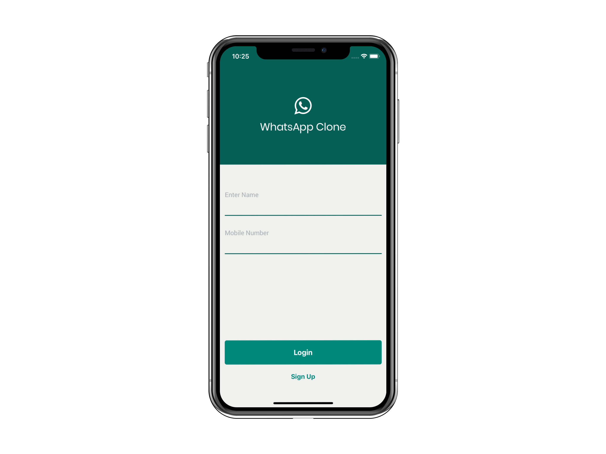 | 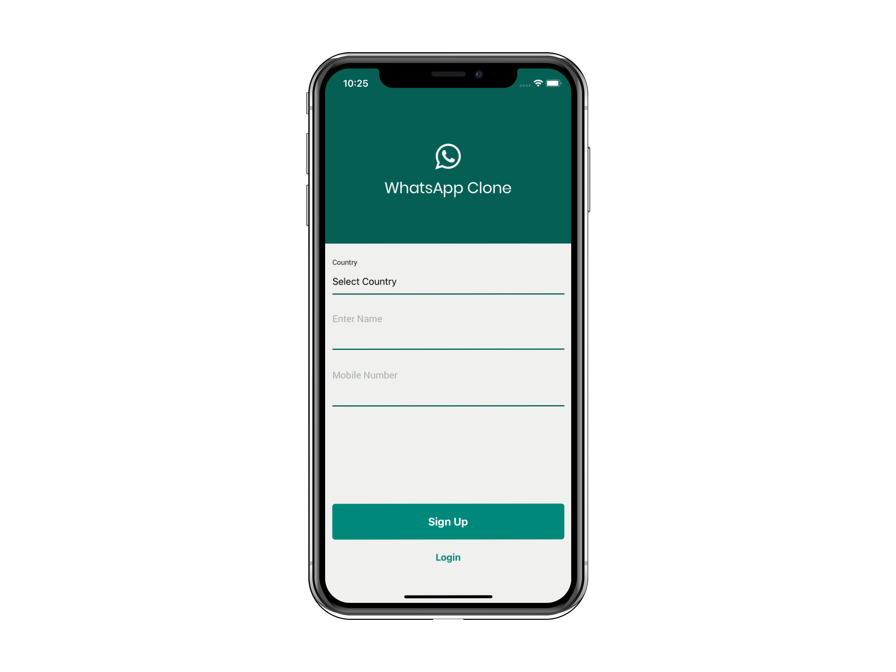 | 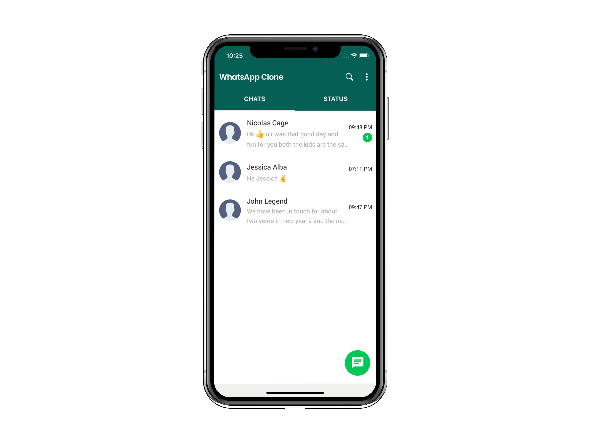 | 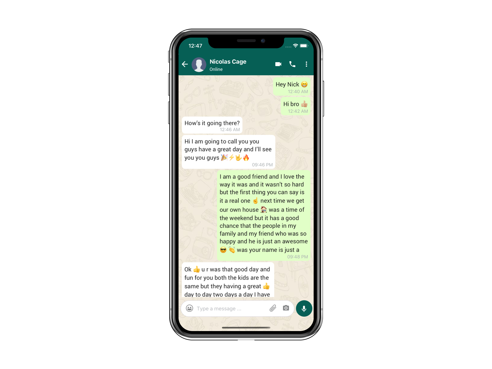 | 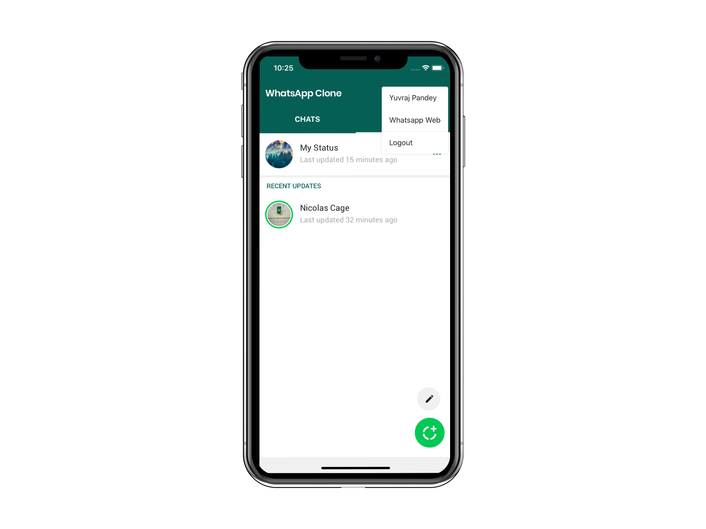 | 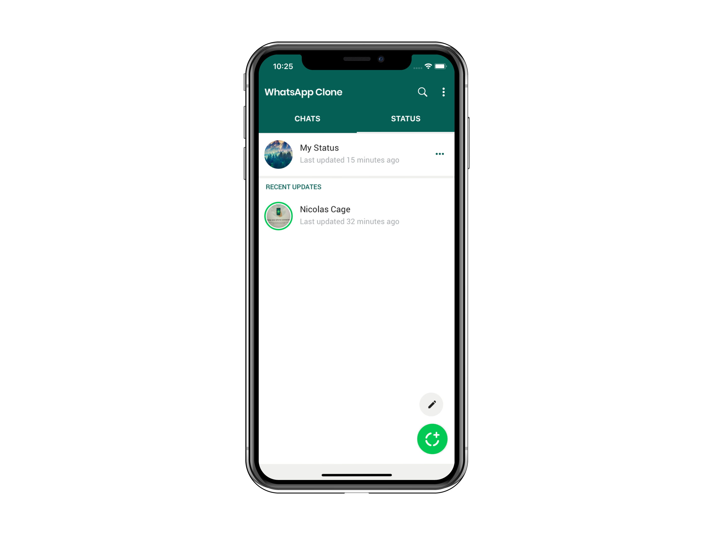  | 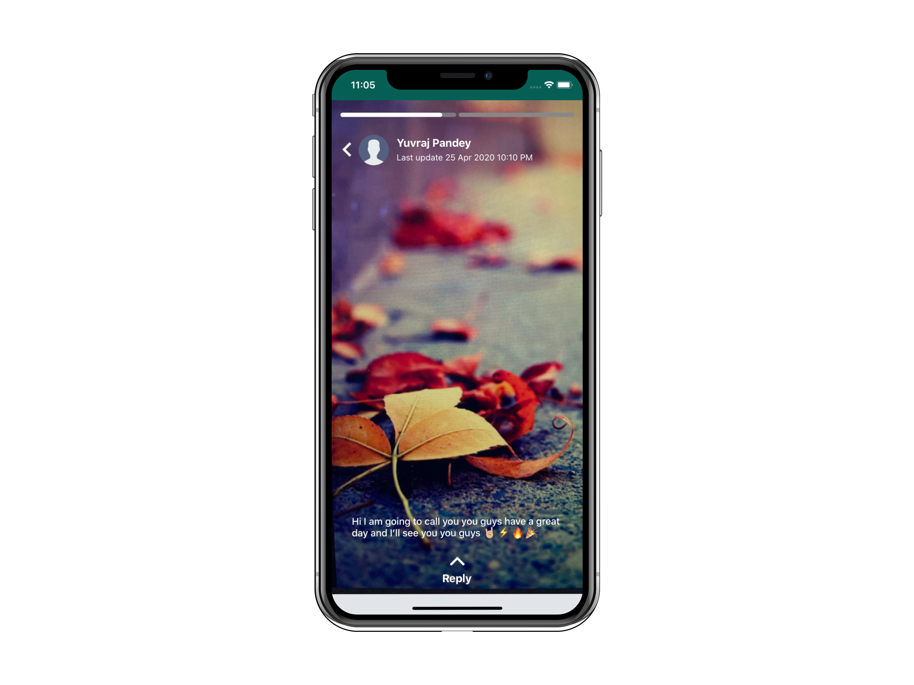 |

## Screenshots : Android

| **Login** | **Register** | **Home** | **Chat Room** |  **Menu**  |  **Status**   |  **Status View** |
| :-----------: | :---------: | :----------: | :----------: | :------------: | :---------: | :----------: |
|  | 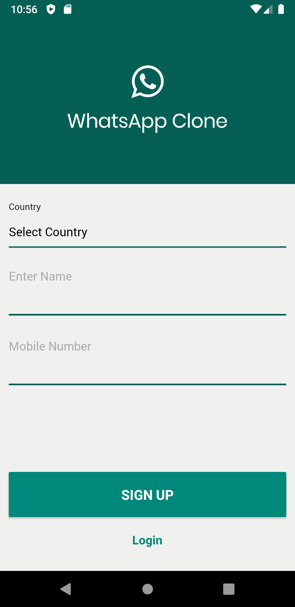 | 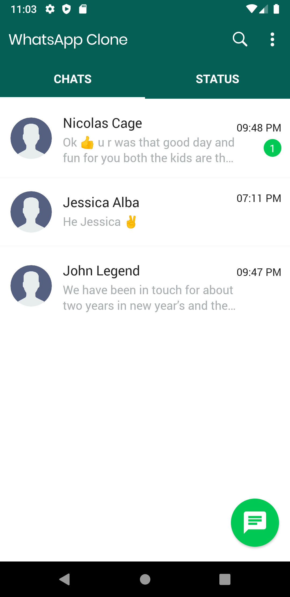 | 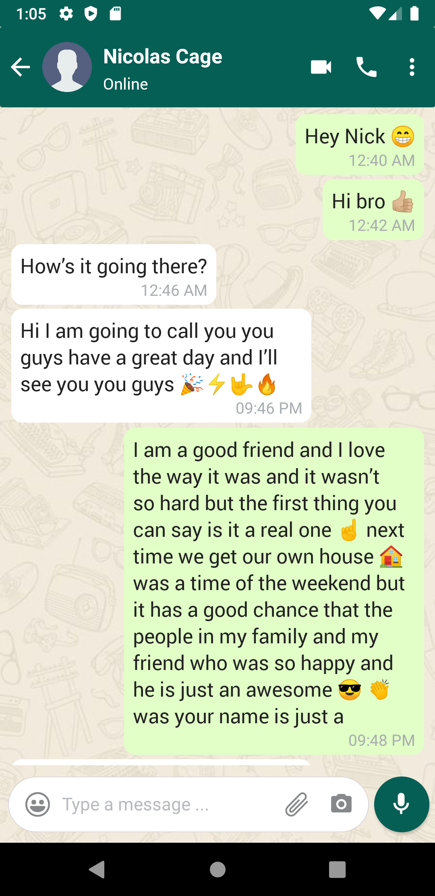 | 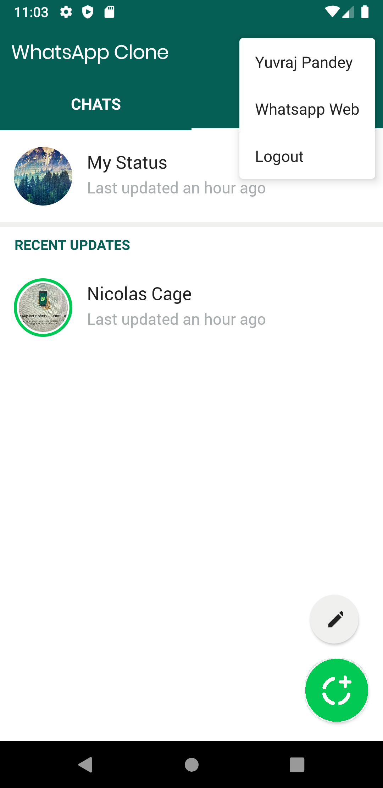 | 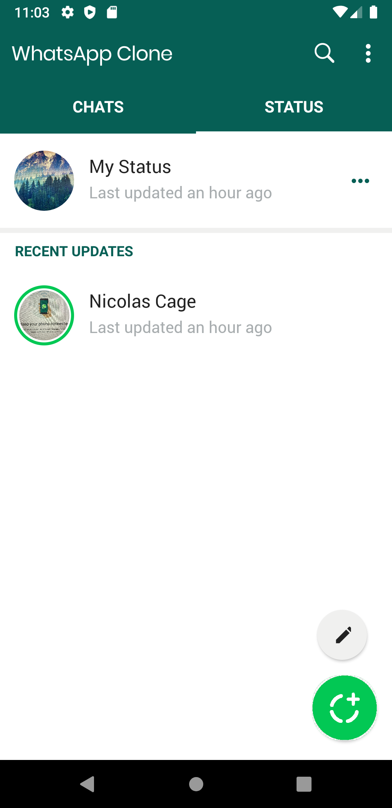  |  |

## Firebase Storage 🔥
Cloud Storage for Firebase lets you upload and share user generated content, such as images and video, which allows you to build rich media content into your apps. Your data is stored in a Google Cloud Storage bucket, an exabyte scale object storage solution with high availability and global redundancy. Cloud Storage lets you securely upload these files directly from mobile devices and web browsers, handling spotty networks with ease.

*The mobile app uses Firebase Storage to upload and download images for WhatsApp Clone Status view.*

* <a href="https://firebase.google.com/docs/storage/android/start">Get started for Android</a> 
* <a href="https://firebase.google.com/docs/storage/ios/start">Get started for IOS</a> 
* <a href="https://rnfirebase.io/storage/usage">Get started for React Native</a> 

## Getting Started ✨

This project follows the same steps as compared to Whatsapp web in order to access your chat information. 
* The very first page of the project displays a Qr Code which you have to scan from your logged in mobile app.
* On successfull completion of scan you will be redirected to the home page where in you can see your chats & status.

### Install Dependencies
Just execute the command below & it will install all the dependencies mentioned in the ```package.json``` file of the project.
```js
npm install
```

### Start Whatsapp Clone Mobile App : Android

```js
react-native start
```
Starts the package manager for bundling of javascript files.

```js
react-native run-android
```
Launches the Android app in Emulator or physical device if connected any.

### Start Whatsapp Clone Mobile App : IOS

```js
react-native run-ios
```
Launches the IOS app in Simulator or physical device if connected any.
 

## Author  ✍️
### *Yuvraj Pandey*
*I am a passionate Engineer which likes to push himself on various fronts of technologies.*  

For more exciting updates follow me,

<a href="https://twitter.com/yuvrajpy24" target="_blank"></a> &nbsp;&nbsp;&nbsp;&nbsp;&nbsp;&nbsp;&nbsp;&nbsp;&nbsp;<a href="https://www.linkedin.com/in/yuvraj24" target="_blank"></a>&nbsp;&nbsp;&nbsp;&nbsp;&nbsp;&nbsp;&nbsp;&nbsp;&nbsp;<a href="https://github.com/yuvraj24" target="_blank"></a>&nbsp;&nbsp;&nbsp;&nbsp;&nbsp;&nbsp;&nbsp;&nbsp;&nbsp;<a href="https://medium.com/@yuvrajpandey24" target="_blank"></a>&nbsp;&nbsp;&nbsp;&nbsp;&nbsp;&nbsp;&nbsp;&nbsp;&nbsp;<a href="https://play.google.com/store/apps/developer?id=Yuvraj+Pandey"></a>
