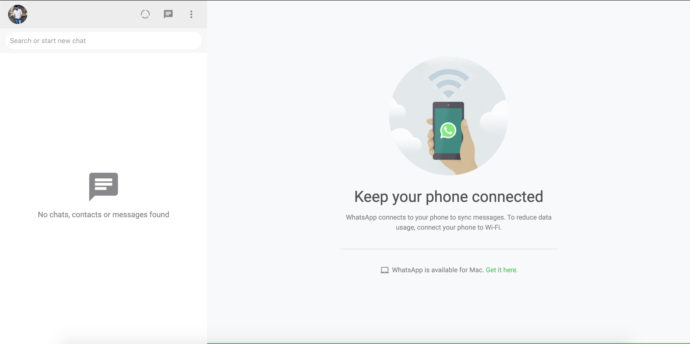
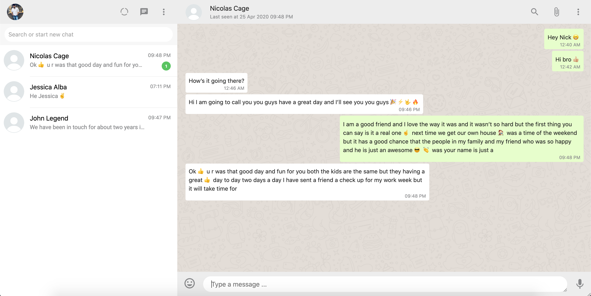
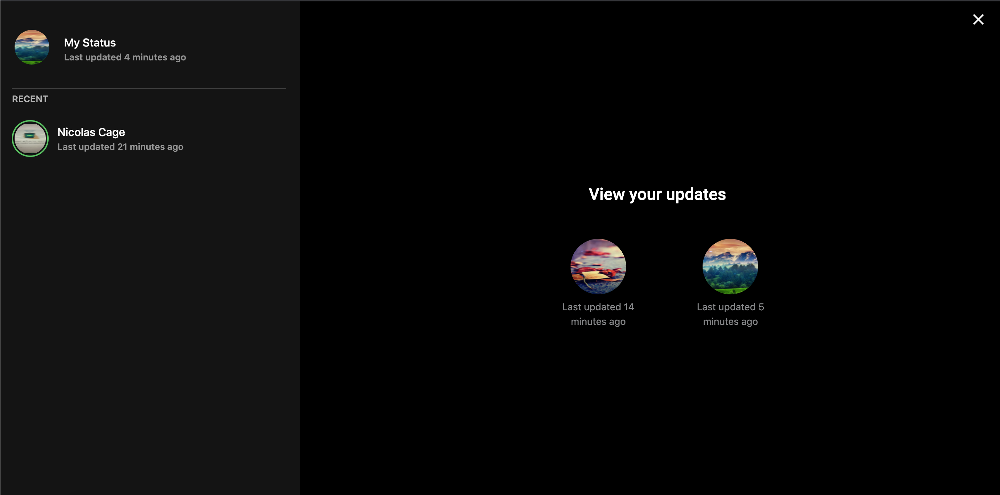

# WhatsApp-Clone-Web 
In an increasingly web-centric world, the website is generally its first impression as well as its first interaction with customers. This part of the repository mainly deals with the web client implementation of the Whatsapp clone. This represents the web version of Whtsapp which you use along side their mobile application.

Following are the main technologies used in order to construct this frontend,
* <a href="https://reactjs.org/">ReactJs</a> 
* <a href="https://www.typescriptlang.org/">Typescript</a>
* <a href="https://github.com/bvaughn/react-virtualized">React Virtualized</a> 
* <a href="https://material-ui.com/">Material UI</a>
* <a href="https://github.com/axios/axios">Axios</a>
* <a href="https://socket.io/">Socket.io-client</a><br> 

## Live Action 🌏
Visit the following website for live action of Whatsapp Clone Web

<a href="https://whatsappclone-614cb.web.app/">WhatsApp Clone Web</a>


## Other Platforms ✨
Refer the following links for platform specific implementation,
* <a href="https://github.com/yuvraj24/WhatsApp-Clone/blob/master/app-client/README.md">Mobile App Client (Android & IOS)</a>
* <a href="https://github.com/yuvraj24/WhatsApp-Clone/blob/master/web-server/README.md">Web Server (Backend)</a>

## Screenshot
<br>

|          **Screens**                  |
| :-----------------------------------: |
|             |<br>
| <br>             |<br>
| <br>             |<br>
| <br>             |<br>
| <br>             |<br>
| <br>             |<br>

## Firebase Hosting 🔥
Firebase Hosting allows fast and secure hosting for our web application, static and dynamic content, and microservices. It is production-grade web content hosting for the developers. We can easily and quickly deploy web apps and serve both static and dynamic content to a global content delivery network with only a single command. We can pair Firebase Hosting with Cloud Function for building and hosting microservices on Firebase. 

Firebase Hosting, by default, provides an SSL certificate and offers an impressive speed across several geographical locations without any requirement for a separate CDN on top

*The Web Application has been deployed via Firebase Hosting*

* <a href="https://firebase.google.com/docs/hosting/use-cases">What can I do with Firebase Hosting?</a>
* <a href="https://firebase.google.com/docs/cli">Website Deployment steps</a>

## Getting Started ✨

This project follows the same steps as compared to Whatsapp web in order to access your chat information. 
* The very first page of the project displays a Qr Code which you have to scan from your logged in mobile app.
* On successfull completion of scan you will be redirected to the home page where in you can see your chats & status.

### Install Dependencies
Just execute the command below & it will install all the dependencies mentioned in the ```package.json``` file of the project.
```js
npm install
```

### Start Whatsapp Clone Web

```js
npm start
```
Runs the app in the development mode. Open http://localhost:3000 to view it in the browser.

```js
npm test
```
Launches the test runner in the interactive watch mode. See the section about running tests for more information.

```js
npm run build
```
Builds the app for production to the build folder. It correctly bundles React in production mode and optimizes the build for the best performance. The build is minified and the filenames include the hashes. Your app is ready to be deployed!

See the section about <a href="https://facebook.github.io/create-react-app/docs/deployment">deployment</a> for more information.
 

## Author  ✍️
### *Yuvraj Pandey*
*I am a passionate Engineer which likes to push himself on various fronts of technologies.*  

For more exciting updates follow me,

<a href="https://twitter.com/yuvrajpy24" target="_blank"></a> &nbsp;&nbsp;&nbsp;&nbsp;&nbsp;&nbsp;&nbsp;&nbsp;&nbsp;<a href="https://www.linkedin.com/in/yuvraj24" target="_blank"></a>&nbsp;&nbsp;&nbsp;&nbsp;&nbsp;&nbsp;&nbsp;&nbsp;&nbsp;<a href="https://github.com/yuvraj24" target="_blank"></a>&nbsp;&nbsp;&nbsp;&nbsp;&nbsp;&nbsp;&nbsp;&nbsp;&nbsp;<a href="https://medium.com/@yuvrajpandey24" target="_blank"></a>&nbsp;&nbsp;&nbsp;&nbsp;&nbsp;&nbsp;&nbsp;&nbsp;&nbsp;<a href="https://play.google.com/store/apps/developer?id=Yuvraj+Pandey"></a>
